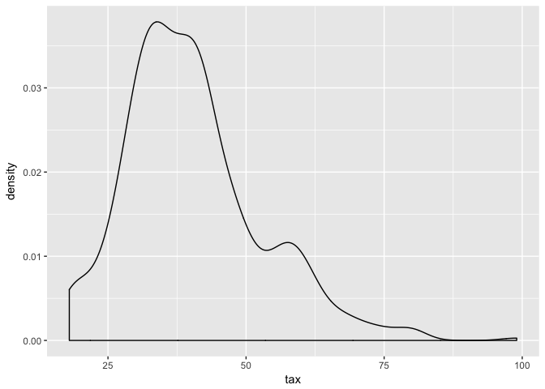
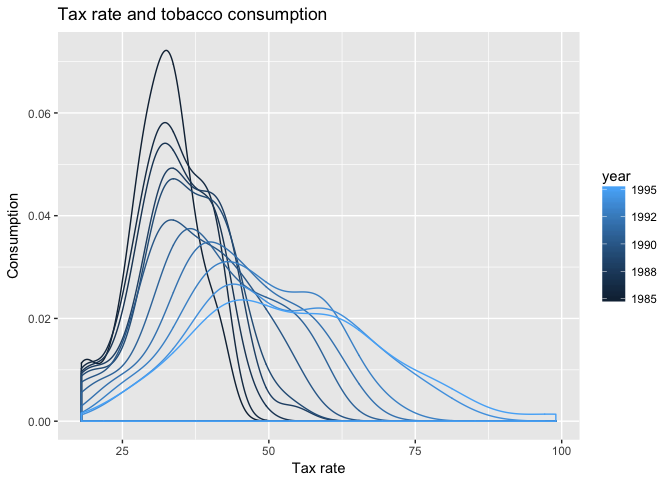
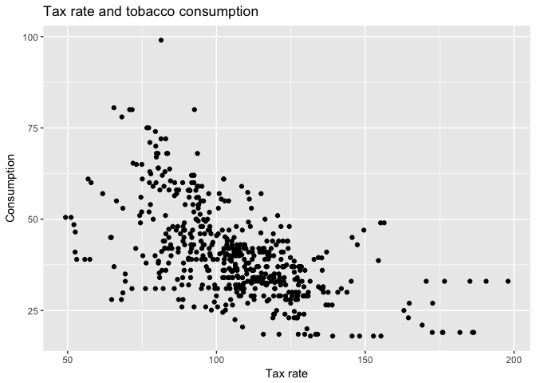

Las herramientas para gráficos en `R` con impresionantes. Personalmente,
me gusta mucho la librería gráfica que viene instalada en `R` por
defecto (es clara, sencilla y permite construir practicamente cualquier
figura que podamos imaginar). Sin embargo, esa flexibilidad viene a
costa de tener que poner mucho esfuerzo para manipular cada elemento de
la figura. La libraría `ggplot2` implementa un sistema de gráficos
conocido como `gramática de gráficos` que es muy popular no solo en `R`
sino en otros lenguajes.

Además, `ggplot2` nos permite tener una excusa para ver cómo añadir
nueva funcionalidad a `R`.

En primer lugar, tenemos que instalar la nueva librería usando:

    install.packages("ggplot2")

La función se dirigirá al un servidor reflejo de CRAN, descarga el
archivo que necesitamos y lleva a cabo la instalación (que incluye un
número de evaluaciones del código y de nuestra máquina). Ahora el
paquete está disponible en nuestro sistema y podemos usarlo en nuestra
sesión usando:

    library(ggplot2)

Echemos un vistazo a nuestros nuevos datos:

    tobacco <- read.csv("http://koaning.io/theme/data/cigarette.csv")

La estructura de una figura en `ggplot2` es sencilla. Primero
definiremos un `data.frame` que aloja los datos que queremos usar,
despues indicaremos las características de la figura que queremos (qué
variables van a cada eje o cómo se definen los grupos) y finalmente el
tipo de figura que queremos (líneas, puntos, barras, ...). Para ello
usamos la función `ggplot`.

Por ejemplo, para definir un gráfico de densidad, todo lo que
necesitamos es indicar qué variable queremos y dónde está esa variable:

    p <- ggplot(tobacco, aes(x=tax))
    p + geom_density()

Añadir una densidad por año es sencillo: todo lo que tenemos que hacer
es declarar qué variable usaremos para definir los grupos (por año) y a
través de qué variable queremos que cambien los colores (por año
también). También añadiremos etiquetas y título:

    p <- ggplot(tobacco, aes(x=tax, group=year, colour=year))
    p + geom_density() +
        labs(title="Tax rate and tobacco consumption", x="Tax rate", y="Consumption")

Un gráfico de dispersión se define a través de dos dimensiones, pero la
estructura es la misma que antes:

    p <- ggplot(tobacco, aes(x=packpc, y=tax))
    p + geom_point() +
        labs(title="Tax rate and tobacco consumption", x="Tax rate", y="Consumption")

¿Cómo guardar la figura que acabamos de generar? La forma más sencilla
quizás sea con `ggsave`:

    p <- ggplot(tobacco, aes(x=tax))
    pq <- p + geom_density()
    ggsave("my-pretty-figure.png", pq)
